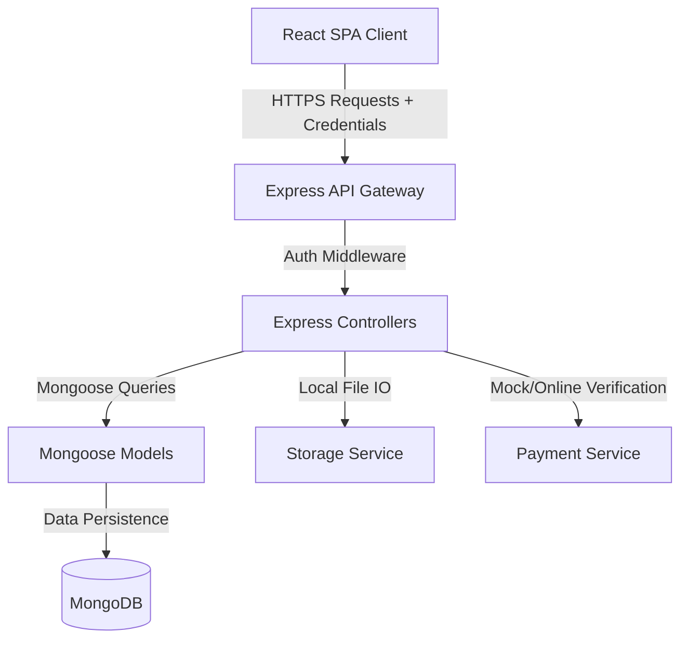

# System Architecture Design

This document details the software architecture, workspace organization, security token flow, and storage abstractions implemented in the Managed Marketplace Platform.

---

## 🏗️ Architectural Overview

The application is structured as a **MERN Stack** (MongoDB, Express, React, Node.js) project organized as a unified workspace. It is separated into a frontend Client and a backend Server:

### Workspace Structure
*   **Root Folder**: Configured as an npm workspace. Scripts in the root `package.json` coordinate concurrent client/server execution, database seeds, and frontend production building.
*   **Client (`/client`)**: Built using Vite, React, TypeScript, and Tailwind CSS. State is managed via React Contexts (`AuthContext`, `CartContext`, `ToastContext`).
*   **Server (`/server`)**: A Node.js/Express REST API. Persists structured data using Mongoose and provides security validation.

---

## 🔑 Authentication & Token Lifecycle

The platform uses a dual-token (Access Token + Refresh Token) system to balance security with user convenience.

### 📋 Token Specifications

1.  **Access Token**:
    *   **Payload**: User ID, Role, Staff Permissions (if applicable).
    *   **Lifespan**: 15 minutes.
    *   **Delivery**: Sent in JSON response body upon login/refresh.
    *   **Storage**: Kept in memory inside the React state (`AuthContext.tsx`).

2.  **Refresh Token**:
    *   **Payload**: User ID, Token version.
    *   **Lifespan**: 7 days.
    *   **Delivery**: Set via `HttpOnly`, `Secure`, and `SameSite=Strict` cookies.
    *   **Storage**: Handled by the browser's cookie storage, inaccessible to client-side JavaScript.

### 🔄 Silent Refresh Sequence

If an API request returns a `401 Unauthorized` status (indicating an expired access token), the client Axios interceptor (`client/src/services/api.ts`) automatically intercepts the failure, pauses outgoing requests, and calls `/api/v1/auth/refresh`.

*   **Success**: The server reads the HttpOnly refresh token cookie, validates it against the user, signs a new access token, and returns it. The client retries the failed requests seamlessly.
*   **Failure**: If the refresh token has expired or is invalid, the interceptor clears client-side credentials and raises a global `auth-expired` event, prompting a redirect to `/login`.

---

## 📦 File Storage Abstraction

To support flexible deployments, file storage is encapsulated by `StorageService.js`.

*   **Buffer Processing**: Multer handles incoming multipart form uploads in-memory (`multer.memoryStorage()`) to prevent temporary files from cluttering the filesystem.
*   **Local Disk Implementation**: Files are stored in a dedicated static folder (`server/public/uploads`). The server exposes this folder via `express.static`.
*   **Expansion Ready**: The interface exposes simple `uploadFile()` and `deleteFile()` contracts, allowing straightforward migration to cloud block storage (e.g. AWS S3, Google Cloud Storage) by swapping the implementation class.

---

## 🔒 Escrow Security & Isolation

The platform acts as a trusted intermediary (escrow manager) to protect both buyers and sellers:

1.  **Buyer Payment**: Buyer pays using Chapa, Telebirr, or Bank Transfer. The platform holds these funds.
2.  **Staff Logistics**: Staff assigns a courier who transports the item.
3.  **Delivery Proof**: Once delivered, the courier updates status to `DELIVERED`.
4.  **Payout Release**: On delivery completion, the seller's Payout record automatically transitions to `ELIGIBLE` for withdrawal. Sellers cannot trigger payouts prematurely.
